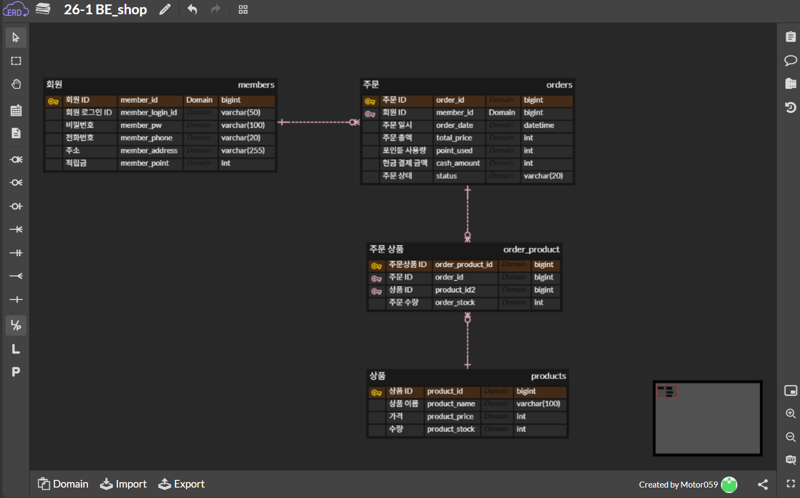
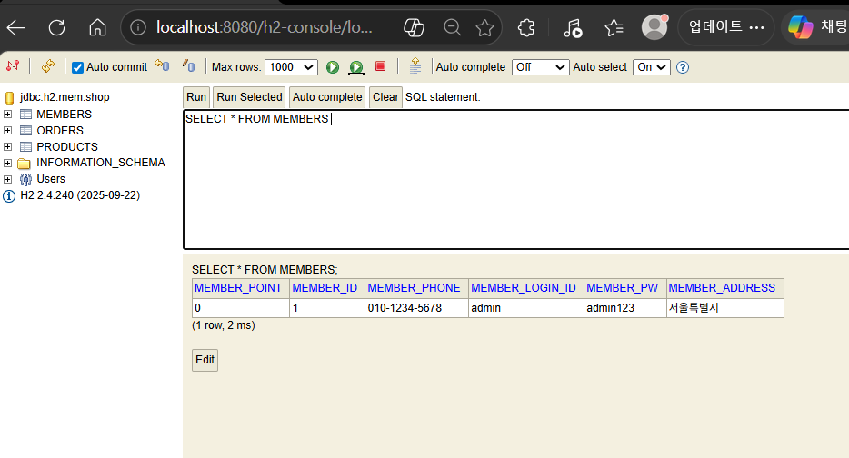
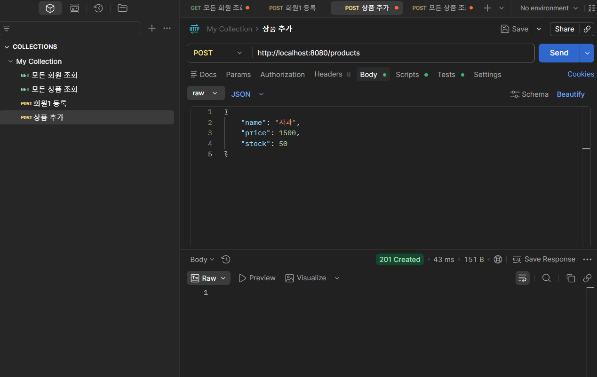
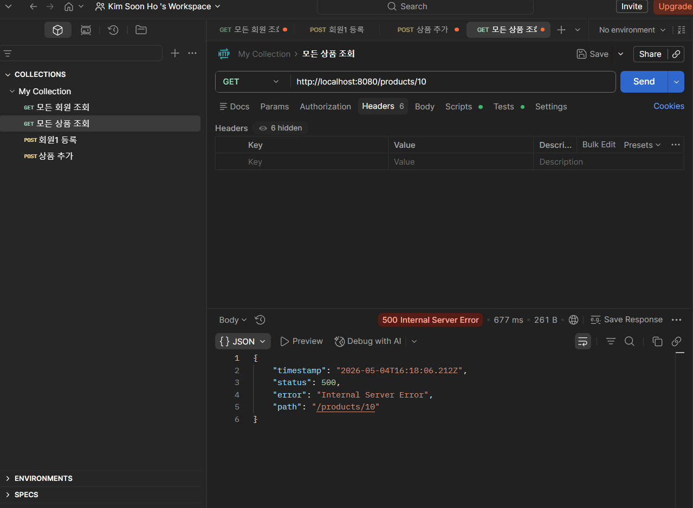

# 4주차 WIL: ERD, DB, 엔티티

---

## **스프링 계층형 아키텍처와 DB**
- **스프링 계층형 아키텍처**: 이전에 학습한 컨트롤러, 서비스, 레포지토리에 이어 엔티티와 데이터베이스(DB)까지 포함하여 전체적인 아키텍처 흐름을 구성함
- **엔티티 (Entity)**: DB 테이블과 직접 매핑되는 핵심 객체로, 데이터 일관성과 보안을 유지하기 위해 외부에 직접 노출하지 않음

## **데이터베이스 모델링과 ERD**
- **ERD (Entity-Relationship Diagram)**: 개체(데이터를 가진 대상)와 관계(개체 사이의 연관성) 중심의 ER 모델링 기법을 시각적으로 표현한 데이터 청사진
- **DB 설계 핵심 용어**:
    - **엔티티**: 회원, 상품, 주문 등 관리해야 할 데이터의 주체
    - **속성 (Attribute)**: 각 엔티티가 가지는 구체적인 정보 (필드, 컬럼)
    - **기본 키 (PK)**: 각 레코드를 고유하게 식별하는 데 사용되는 하나 이상의 필드
    - **외래 키 (FK)**: 다른 테이블의 PK를 참조하여 테이블 간 연결고리 역할을 하는 속성
- **관계 (Relation)**:
    - **일대다 (1:N)**: 한 개체가 다른 개체 여러 개와 관계를 맺는 형태 (예: 회원 1명과 주문 N개)
    - **다대다 (N:M)**: 관계형 DB에서는 선 하나로 직접 표현할 수 없어, 반드시 **중간 테이블(연결 엔티티, 예: 수강신청)**을 도입해 두 개의 일대다(1:N) 관계로 풀어내야 함
- **식별 vs 비식별 관계**: 식별 관계는 관계 대상의 PK를 자신의 PK로도 사용하는 강한 연관 관계이며, 비식별 관계는 대상을 FK로만 참조하는 느슨한 연관 관계로 보통 비식별 관계를 권장함

## **엔티티 매핑 실습 (JPA)**
- **기본 매핑 어노테이션**:
    - `@Entity`, `@Table`: 해당 클래스가 JPA 엔티티임을 명시하고 매핑할 DB 테이블의 이름을 지정함
    - `@Id`, `@GeneratedValue`: 기본 키를 지정하며, `strategy = GenerationType.IDENTITY`를 적용해 키 생성을 DB에 위임함
    - `@Column`: 객체 필드와 DB 컬럼을 매핑하며 컬럼명, 길이 등을 설정함
- **생성자 접근 제어**: JPA는 인자 없는 기본 생성자를 필요로 하므로, 무분별한 빈 객체 생성을 막기 위해 `@NoArgsConstructor(access = AccessLevel.PROTECTED)`를 사용하여 외부에서의 접근을 차단함
- **연관관계 매핑 (FK)**:
    - `@ManyToOne`, `@JoinColumn`: 다대일 관계에서 엔티티 객체를 필드로 넣고 외래 키를 매핑할 때 사용함
    - **Fetch Type (EAGER vs LAZY)**: 연관된 객체 정보를 한 번에 즉시 가져오는 EAGER(즉시 로딩) 방식보다, 필요할 때만 지연해서 가져오는 LAZY(지연 로딩) 방식을 명시적으로 지정하는 것이 좋음

## **DB 설정 및 API 테스트**
- **DB 연결 설정 (`application.yml`)**: 내장형 메모리 DB인 H2 데이터베이스의 접속 URL(`jdbc:h2:mem:shop`) 설정, H2 웹 콘솔 활성화, JPA가 생성하는 SQL 로그 출력 및 포맷팅 등을 설정함
- **API 테스트**: 엔티티 계층까지 구현이 완료되면 Postman 도구를 활용하여 컨트롤러의 CRUD API (회원, 상품, 주문 등)가 설계한 대로 정상 작동(성공 및 에러 처리)하는지 테스트할 수 있음

## **과제 스크린샷**

### ** DB ERD 테이블 관계도**

### **H2 데이터베이스 테이블 생성 확인 **

### **Postman API 테스트 결과 **
**성공 케이스 (상품 등록 201 Created)**

**실패 케이스 (없는 상품 조회 500 Error)**
