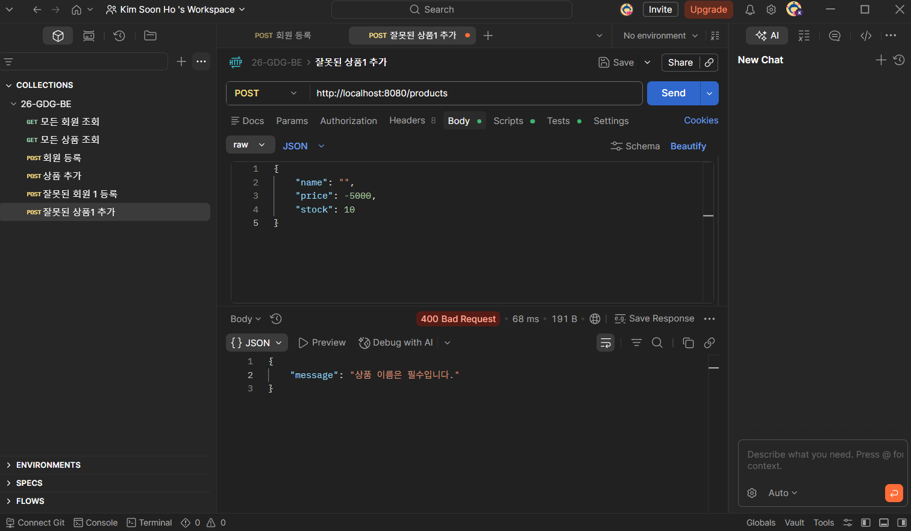
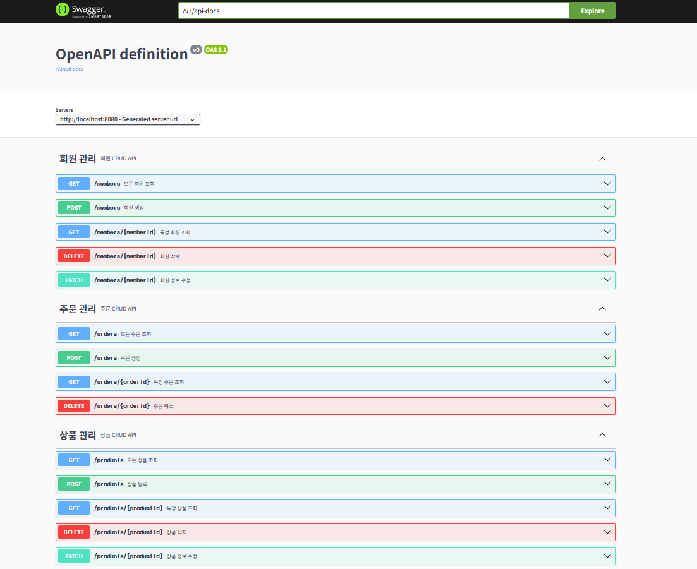

# 6주차 WIL: 예외 처리와 Swagger

---

## **1. DTO와 유효성 검사 (Validation)**
- **유효성 검사의 필요성**: 클라이언트로부터 항상 의도한 데이터만 들어온다는 보장이 없으므로, 데이터가 데이터베이스나 비즈니스 로직에 도달하기 전에 올바른 형식인지 미리 검사해야 함.
- **적용 방법**: 
  - `spring-boot-starter-validation` 의존성을 추가함.
  - DTO 필드에 `@NotNull`, `@Size`, `@Pattern`, `@Min` 등의 어노테이션을 사용하여 제약 조건과 에러 메시지를 명시함.
  - Controller의 파라미터 앞에 `@Valid` 어노테이션을 붙여 실제 검사가 수행되도록 함.

## **2. 전역 예외 처리 (Global Exception Handling)**
- **예외 처리의 목적**: 클라이언트의 잘못된 요청으로 발생한 에러를 서버 내부 에러(500 Internal Server Error)로 모호하게 응답하는 대신, 4xx 상태 코드와 함께 명확한 원인을 알려주기 위함.
- **@ControllerAdvice와 @ExceptionHandler**: 
  - 특정 컨트롤러에 종속되지 않고 애플리케이션 전역에서 발생하는 예외를 중앙(GlobalExceptionHandler)에서 가로채서 처리하는 AOP(관점 지향 프로그래밍) 방식을 적용함.
- **커스텀 예외와 상수화**: 
  - `RuntimeException`을 상속받는 `NotFoundException`, `BadRequestException` 등 커스텀 예외 클래스를 만들어 사용함.
  - 에러 메시지는 하드코딩하지 않고 `ErrorMessage` 클래스에 `public static final String` 상수로 관리하여 유지보수성을 높임.

## **3. API 문서화 (Swagger)**
- **Swagger 도입**: 프론트엔드 개발자 등 협업하는 팀원들과 명확하게 소통하기 위해 `springdoc-openapi`를 사용하여 API 명세서를 자동화된 웹 문서로 제공함.
- **주요 어노테이션**:
  - `@Tag`: 컨트롤러 레벨에서 API를 그룹화하고 제목을 부여함.
  - `@Operation`: 각 메서드(API 엔드포인트)의 요약(summary)과 상세 설명(description)을 작성함.
  - `@ApiResponse`: 200, 201, 400, 404 등 다양한 HTTP 응답 상태 코드에 따른 상황을 문서에 명시함.

---

## **과제 인증 스크린샷**

### **1. 4xx + 에러 메시지 응답 (Postman)**

### **2. Swagger UI API 문서**
